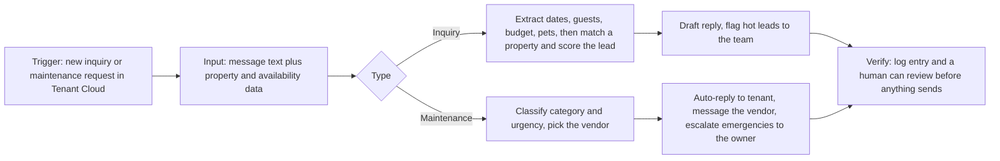

# Workflow

```mermaid
graph LR
    A[Trigger: new inquiry or maintenance request in Tenant Cloud] --> B[Input: message text plus property and availability data]
    B --> C{Type}
    C -->|Inquiry| D[Extract dates, guests, budget, pets, then match a property and score the lead]
    C -->|Maintenance| E[Classify category and urgency, pick the vendor]
    D --> F[Draft reply, flag hot leads to the team]
    E --> G[Auto-reply to tenant, message the vendor, escalate emergencies to the owner]
    F --> H[Verify: log entry and a human can review before anything sends]
    G --> H
```
